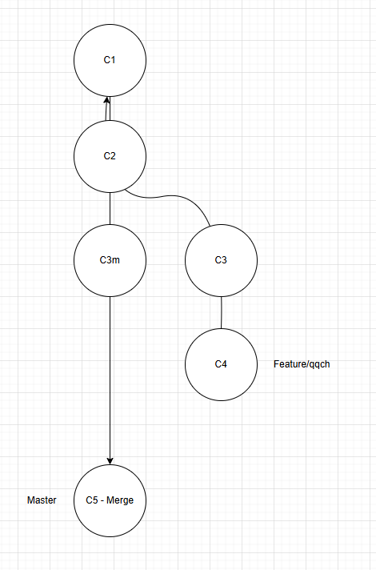

# Git

## Commandes principales

### Initialiser un répertoire de travail Git

```bash
git init
```

### Visualiser les modifications actuelles du dossier de travail

```bash
git status
```

### Ajouter un fichier / emplacement à la staging area

* Pour ajouter un emplacement à la staging area

```bash
git add chemin/de/fichier
```

* Pour ajouter tous les fichiers de notre emplacement racine à la staging area

```bash
# Syntaxe classique
git add .

# Autres syntaxes
git add --all
git add -A
```

### Enregistrer les changements dans le repository

```bash
git commit -m "Message du commit"
```

### Afficher les informations des commits

```bash
git log
```

### Manipuler les branches

* Pour afficher les branches

```bash
git branch
```

* Pour créer une nouvelle branche

```bash
git branch nom-de-branche
```

### Pour passer d'une branche à l'autre

```bash
# Syntaxe "à l'ancienne"
git checkout nom-de-branche

# Pour créer la branche en même temps que de naviguer dessus
git checkout -b nom-nouvelle-branche

# Syntaxe moderne
git switch nom-de-branche

# Pour créer la branche en même temps que de naviguer dessus
git switch -c nom-nouvelle-branche
```

### Pour rapatrier les changement d'une autre branche vers l'actuelle

```bash
git merge nom-branche-a-rapatrier
```

En cas de conflit, il va falloir le résoudre (choisir quels changements seront conservés entre ceux faits sur la branche actuelle et celle que l'on veut rapatrier). 

Si pas de conflits, le merge se fera par défaut de façon fast-forward.

### Exemple de merge 



### Annuler un changement avant de commit

Si l'on s'est trompé, on peut annuler nos changements actuels et les conserver dans un emplacement à part via: 

```bash
git stash
```

### Annuler un changement après avoir commit

Dans le cas où l'on aurait déjà réalisé le commit (et que l'on l'aurait déjà publié sur le repository), alors il faut faire en sorte de sauvegarder l'action de "Annule le dernier commit", de sorte à ce que la branche contienne cette action (une branche pointe de base vers le dernier commit enregistré). 

```bash
git revert <id-commit>
```
### Comparer les changement entre commits

* Pour comparer entre les fichiers actuels et un commit précédent: 

```bash
git diff <id-commit>
```

* Pour comparer entre deux commits précédents: 

```bash
git diff <id-commit-A> <id-commit-B>
```

### Pour retourner à un commit précédent

* Si l'on a envie de conserver la staging area et les fichiers (on s'est trompé dans le message du commit par exemple): 

```bash
git reset --soft <id-commit>
```

* Si l'on a envie de supprimer la staging area mais de conserver les fichiers (on veut faire des commits plus séparés pour créer plus de détail par exemple): 

```bash
git reset <id-commit>
# ou
git reset --mixed <id-commit>
```

* Si l'on a envie de supprimer la staging area et les fichiers (on veut repartir complètement de zéro): 

```bash
git reset --hard <id-commit>
```

Il est également possible de le faire via les pointeurs de branche ou la tête de visionnage de git: 

```bash
# X sera ici 'combien de commit en amont on peut remonter'
git reset HEAD~X
```

### Ajouter des identifiants aux commit (Tags)

Pour pouvoir retrouver plus facilement un commit, il peut être intéressant de lui donner un nom plus compréhensif par un utilisateur classique. Pour cela, on va tag un commit: 

```bash
git tag -a <nom-tag>
```

Il est possible d'ajouter également au besoin un message descriptif: 

```bash
git tag -a <nom-tag> -m "Texte descriptif"
```

### Pour cloner un repositoy distant

Si l'on a déjà un repository distant et que l'on veut simplement récupérer le code présent sur la plateforme et y être automatiquement "branché" pour la suite de notre travail, on peut utiliser: 

```bash
git clone <url> 

# Si l'on veut également choisir le nom de dossier où va être cloné le repertoire
git clone <url> <nom-dossier> 
```

### Relier un répertoire local à un repertoire distant

Dans le cas où l'on aurait déjà fait une partie du travail en local et que l'on veut simplement mettre tout cela en ligne, on ne va pas cloner un repertoire pour y mettre tout notre travail (cela ruinerai l'historique des commits, nos tags ainsi que les branches en aplatissant le tout en un seul commit sur une branche dont on ne choisirai même pas le nom !).

On va simplement relier notre répertoire à un repertoire distant: 

```bash
git remote add <nom-remote> <url>
```

Il est d'ailleurs possible d'avoir plusieurs remotes pour pouvoir travailler dans plusieurs endroits

### Pour ajouter des changements au repo distant

Dans le cas où l'on veut ajouter nos commits actuels à notre repository distant, on peut utiliser la commande:

```bash
git push <remote> <branche>
```

### Pour récupérer des changements faits à distance

Lorsque l'on veut récupérer les changements distants, il nous faut dans un premier temps en avoir conscience. Pour cela, on va utiliser `git fetch`. Ensuite, on va pouvoir les rapatrier comme on le ferai avec n'importe quelle branche. Cela nous donne: 
```bash
git fetch <remote>

git merge <remote>/<branche>
```

Mais, la plupart du temps, on va simplifier la chose en utilisant la commande ci-dessous, qui se charge de faire les actions des deux commandes d'un coup:
```bash
git pull <remote> <branche>
```

### Fusionner deux branches avec un historique linéaire

Si l'on veut éviter les soucis relatifs à l'utilisation de `git merge` ainsi que la création potentielle de commit de merge, on peut utiliser une autre commande git ayant pour vocation de mettre à jour une branche en prenant en compte tous les changements d'une autre branche. Celle ci est: 
```bash
git rebase <branche>
```
